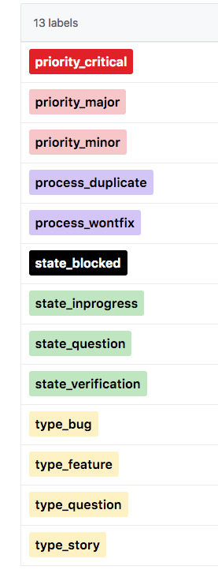

# Content Rules

Github has proven to work to let millions of people collaborate.

## single source of truth

we do whatever we can to store everything in github this gives us following advantages

- version control
- merging capabilities
- issues can be created where content is
- milestones can be used to organize work (is like roadmap)
- kanban overview (waffle.io) gives a nice overview of work which needs to be done

### some repo types

- info_... all content in markdown documents, to be re-used in website's
- www_... website(s) content
- data_... for data (if not part of info_ ... or not hosted somewhere as webservice)

## github first

- all issues/feature requests/stories/questions to do with content (product, info, website, ...) goes onto a github repo.

## only labels we use

Labels are used for 

- type
- priority
- state (swimlanes in kanban = waffle.io)

Milestones are used to put issues into certain milestone.
The Milestones are the same over all repo's

## DO NOT

Use trello to organize work around content, should only be in github.
In Trello can create a card which links to kanban for e.g certain milestone.

